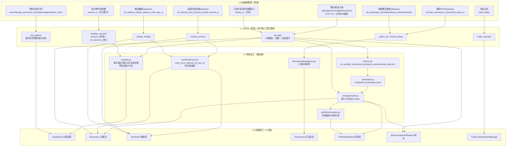

# ETF 监控系统 — 数据血缘全景

> 自上而下梳理：前端每个可视化数据 → 加工层 → 落库 → 远端原始数据源。
> 生成日期：2026-08-12（对应后端领域重构后的目录结构）。

## 1. 总体架构（4 层）

```
L0 远端数据源（9 个）──▶ L1 SQLite 落库（7 张表）──▶ L2 领域加工 ──▶ L3 API ──▶ L4 前端展示
```



## 2. 逐页面数据血缘（自上而下）

### 2.1 Dashboard 大盘监控 → `/api/signals` `/api/realtime` `/api/stats`

| 前端元素 | 数据 | 血缘链 |
|---|---|---|
| 信号卡：价格/涨跌幅/量比 | price, change_pct, volume_ratio | 盘中：腾讯实时行情→`calc_intraday_signal`（U型修正量比）→etf_realtime→`/signals/today`；盘后：K线→etf_daily |
| 信号卡：量能/方向/份额条 | vol_prob, dir_prob, share_prob | K线+指数K线+份额→`factors.py` 分段映射→落库 |
| 信号卡：综合概率+分级 | composite_prob, signal_level | 上三者→`composite.py` 4层门控→≥70 HIGH/≥50 MID |
| 信号卡：位置/方向徽章 | price_position, trade_direction | K线 60 日区间 + 量比≥1.5 判定 |
| 信号卡：溢价率 | premium_pct | ETF实时价 ÷ (prev_close×指数涨跌幅推算净值) − 1 |
| 实时行情列表 | `/realtime/quotes` | 腾讯实时行情直出（原始） |
| 盘中成交额 | `/realtime/turnover` | 盘中累计→`est_amount_yi`(U型修正)→历史分位 |

### 2.2 Resonance 共振页 → `/api/resonance/*`

| 前端元素 | 数据 | 血缘链 |
|---|---|---|
| 五盏灯 | 5 个 state | 每个=阈值判定：价格位置≥70红/≤40绿；share_prob≤30红/≥65绿；composite_prob≤35红/≥65绿；成交额、融资分位≥80红/≤20绿 |
| 红绿计数/共振判定 | red_count, verdict | 5 灯中同色≥3 → 危险/机会共振 |
| 热力图/灯珠历史 | history[] | 每日同上，逐日 |
| 证据弹窗 | evidence | `evidence.py` 为每盏灯生成 method/formula/thresholds/reason/inputs（推理链） |
| 买卖点 | `/resonance/trades` | **不在共振域计算**：etf_daily+分位→`strategy/router.py` 各 ETF 专属策略 |
| K线图 | `/etf/{code}/history` | etf_daily 真实 OHLC 或收盘反推 |

### 2.3 Sentiment 情绪页 → `/api/sentiment/overview`

| 前端元素 | 数据 | 血缘链 |
|---|---|---|
| 成交额曲线 | total_amount_yi（原始） | 交易所→market_turnover |
| MA5/量比曲线 | ma5_yi, vol_ratio | 成交额 5 日均 + 当日/MA5 |
| 融资曲线 | fin_balance_yi, net_fin_buy_yi | 原始 + 差分 |
| 情绪区（安全/中性/危险） | zone/score | 成交额分位+融资分位→`compute_zone`（两级分位得分相加） |

### 2.4 Derivatives 衍生品页 → `/api/derivatives/*`

| 前端元素 | 数据 | 血缘链 |
|---|---|---|
| PCR/基差曲线 | option_pcr/futures_basis 全字段 | 原始，直接展示 |
| 背离信号 | TOP/BOT + score/grade/rules | K线+PCR+基差→`divergence.py`（5日变化率/120日分位/10规则打分≥2.0） |

### 2.5 PortfolioBacktest 回测页 → `/api/portfolio/backtest`

| 前端元素 | 数据 | 血缘链 |
|---|---|---|
| 净值曲线/仓位 | curve[] | 买卖点+收盘价+交易日历→`simulator.py` 模拟（每份金额=资金/标的数） |
| 交易记录 | trades[] | 同上模拟器输出 |
| 单 ETF 净值/份额申赎 | etf_series | 收盘价归一化 + shares_delta_yi |
| 买卖点输入 | trades_by_code | **与共振页共用** `strategy/router.py` |

### 2.6 K线对比/详情页 → `/api/etf/*`

| 前端元素 | 数据 | 血缘链 |
|---|---|---|
| K线 | OHLC | etf_daily 真实 OHLC（回填脚本补）或涨跌幅反推 |
| 历史信号标注 | daily_signals | etf_daily 整行（因子+合成+方向） |
| 买卖点 | 同共振页 | strategy/router.py |

## 3. 未在前端直接展示、但参与生成的数据（隐藏中间量）

| 数据 | 存在位置 | 参与生成 |
|---|---|---|
| 指数 K线（000300） | fetch 层、内存 | `dir_prob` 的 f2/f3（超额收益、趋势）、盘中 idx_chg |
| idx_chg（指数涨跌幅） | etf_daily 列 | `dir_prob` f1 逆市护盘判定 |
| volume_ma20 | etf_daily 列 | volume_ratio 的分母 |
| t5_etf / t5_idx（5日收益） | 计算中间量 | `dir_prob` f2/f3 |
| U型量能修正系数 | intraday.py 常量 | 盘中量比、全天成交额预估 |
| 推算净值（prev_close×指数涨幅） | 计算中间量 | premium_pct |
| 份额前一日值 | 内存/库 | shares_delta_yi/pct 差分 |
| signal_date（信号日） | 内存 | 组合回测"次日成交"时点 |
| 分位窗口样本明细（window/below/equal） | 计算中间量 | 只在证据弹窗 inputs 展示 |
| 指数实时行情 | fetch 层 | 盘中 idx_chg、溢价推算 |

## 4. 两个值得注意的设计点

1. **份额数据是"半原始"**：`shares_yi` 来自交易所（原始），但 `shares_delta_pct`（差分）和 `share_prob`（映射）是加工；且份额 T+1 发布——当日盘中用的是前一日份额。
2. **etf_daily 是"仓库型"表**：原始 K线、份额与全部加工因子混存一张表，是 6 个页面的共同数据源；而 `etf_realtime` 只服务 Dashboard 盘中模式。
